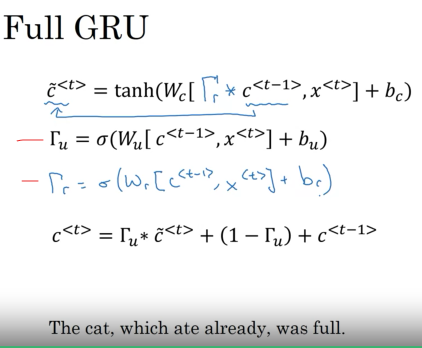

### Week 1
#### Recurrent Neural Networks
#### Why Sequence Models?
##### Examples of Sequence Data
- Sepeech recognition
- Music generation
- Sentiment classiciation
- DNA sequence analysis
- Machine translation
- Video activity recognition
#### Notation
- There is a notation for training examples and examples within the training examples?
- Wtf why am I learning this?
### Recurrent Neural Network Model
#### Why not a standard network?
- Problems:
	- Inputs, outputs can be different lengths in different examples
	- Doesn't share features learned across different positions of text. The context could be different for a the same word showing up in a different location.
#### Recurrent Neual Networks
- Are normal neural networks with something called a recurrent connection.
  - The recurrent connection may be hard to understand. So you can unroll it.
- Say on the third input, output. To predict the 3rd output it also considers the two examples that came before it.
	- How??
- Bidirectional Recurrent Neural Networks use information from before and after the input that it just saw.
#### Forward Propagation
- 
### Back Propagation through time
- We will see how back propagation works in RNNs.
- Its still basic back propagation but there are the recurrent connections that have to be unrolled and those unrolled vectors are the dependencies from earlier or in the future for bidirectional RNNs therefore its called Backpropagation through time.
#### Forward Progation and Backpropagation
- We are backprogating by going backwards from the end to the beginning. Hence its called backpropagation through times.
### Different Types of RNNs
- T_x, T_y are not always the same. What are T_x and T_y??
#### Examples of RNN architectures
- Many to Many
- One to Many
- One to One
- Many to One
#### Summary of RNN types
- ??????
### Language Model and Sequence Generation
#### What is language modelling?
- Say you say something that sounds like these two sentences below. The goal of the language model is to pick the right sentence of what you just said based on training
#### Language Modelling with an RNN
- Tokenize the snetence.
- There is a database of words. So if you encounter an unknown word replace it with a unknown token.
#### RNN model
- Each input gets the average of the words that came before it.
- P(average | currentword) => What is the probability of the current word given the average that came before it.
- If some of these ideas seem abstract (they do!) don't worry we will get to do a concrete implementation in the programming exercise.
### Sampling Novel Sequences
- One of the ways you can get a sense for what the neural network has learned after training.
#### sampling a sequence from a trained RNN
- We have a bunch of probabilities of words that can occur after training on a training set. We use np.random.choice to choose one of those probabilities randomly.
### Vanishing Gradients with RNNs
- The basic RNN we have seen is not very good at capturing long term dependencies.
- Its hard for the backprop to go back a ton of inputs. The gradient decreases or incereases exponentially.
  - Exploding gradients are easier to spot because the numbers just blow up.
  - Solve exploding gradients by doing gradient clipping. Clip the gradient values at some maximum values.
  - Vanishing gradients are much harder to solve.
### Gated Recurrent Unit (GRU)
#### RNN Unit
- Has a weight that takes in the activation from last time and the input at the current iteration.
#### GRU
- c = memory cell
- The GRU stores a value from the previous dependency that will help evaluate what the value needs to be at the current location.
- the value of c\<t\> gets maintained across a long period of time because of the way the equations are constructed.
-  The units marked by red marking are the gated units.
- GRUs and Long Short Term Memory (LSTMs) are common implementations of these ideas that are used.
### Long Short Term Memory (LSTM)
- This is even more powerful than the GRU
- These past few sections have been really confusing. I have to get to the source of what is happening here.
- There are 3 gates: update, forget, and output gates.
- There is not a universally better model between GRU and LSTM. GRUs are a simpler unit.
### Bidirectional RNN
- Will help you take information from before and after the current sequence.
- this is a modification that you can make to a regular RNN, GRU, or LSTM.
#### Deep RNNs
- You can have layers for RNNs for all of the activations.
### Quiz
#### Notation
- the parenthesis represent the training example and the ankle braces represent the word. Choose the training example and the word.
#### RNN
- Inputting an image and outputting a label for a RNN is an example of a one-to-one architecture
- Inputting a audio clip and outputting a transcript is an example of a many-to-many architecture.
- Language recognition from speech(input a audio clip and output a label indicating the language being spoken) is an example of a many-to-one architecture.
- Is inputting a piece of text a many or one for the first dimension of the architecture?
- I don't understand why the image is not a many architecture input...\
#### RNN Probabilties
- The probabilities output by the RNN is not used to pick the highest probability word.
  - The wrong answer: "Use the probabilities output by the RNN to pick the highest probability word for that time step..."
#### Solve RNN backpropagation Gradient vanishing problem
- For the signal to backpropagate without vanishing, we need c\<t\> to be highly dependent on c\<t-1\>
  - I have to set $\gamma$ u to 0 or $\gamma$ r to be 1.
#### Building your Recurrent Neural Network - Step by Step
- Assignment endpoints:
  - Define notation for building sequence models
  - Describe the architecture of a basic RNN
  - Identify the main components of an LSTM
  - Implement backpropagation through time for a basic RNN and an LSTM
  - Give examples of several types of RNN
- We are going to later this week generate music using an RNN! 
- Finished implementing RNNs:
  - This basic implementation of RNN suffers from vanishing gradients problem
  - RNN works best when each output can be estimated using "local" content.
  - "Local" context refers to information that is close to the predictions time step t.
- What to remember about RNNs:
  - The recurrent neural network, or RNN, is essentially the repeated use of single cell which we built.
  - A basic RNN reads inputs one at a time, and remembers information through the hidden layer activations (hidden states) that are passed one time step to the next.
    - The time step dimension determines how many times to re-use the RNN cell.
  - Each cell takes two inputs at each time step:
    - The hidden state from the previous cell
    - The current time step's input data
  - Each cell has two outputs at each time step:
    - A hidden state
    - A prediction
- LSTM
  - Forget Gate is a tensor containing values between 0 and 1.
    - If a unit in the forget gate has a value close to 0, the LSTM will "forget" the stored state in the corresponding unit of the previous cell state.
    - If a unit in the forget gate has a value close to 1, the LSTM will mostly remember the corresponding value in the stored state.
  - The candidate value (c tilde ^ \<t\>) is a tensor containing information from the current time step that may be stored in the current cell state (c^<t\>)
    - The parts of the cadidate value that get passed on depend on the update gate.
    - The candidate value is a tensor containing values that range from -1 to 1.
  - *tanh* produces values between -1 and 1
  - Update gate
    - you will use the update gate to decide what aspects of the candidate c tilde ^ <t\> to add to the cell state c^<t\>
    - The update gate is a tensor with values between 0 and 1.
      - If the unit in the update gate is close to 1 it allows the value of the candidate to be passed to hidden state a^<t\>.
      - When a unit in the update gate is close to 0, it prevents the corresponding value in the candidate from being passed onto the hidden state.
  - Cell State (c^<t\>)
    - The cell state is the "memory" that gets passed into future time steps.
    - The new cell state c^<t\> is a combination of the previous cell state and the candidate value.
  - Output gate
    - Decides what gets sent as the prediction (output) of the time step
  - **What I need to remember about LSTMs**:
    - An LSTM is similar to an RNN in that they both use hidden states to pass along information, but an LSTM also uses a cell state, which is like a long-term memory, to help deal with the issue of vanishing gradients.
    - A LSTM cell consists of a cell state, or long-term memory, a hidden state, or short-term memory, along with 3 gates that constantly update the relevancy of its inputs:
      - A forget gate, update gate, output gate
#### Homework
- Understand sequence models: RNNs.
- GRUs and LSTMs and why they were invented