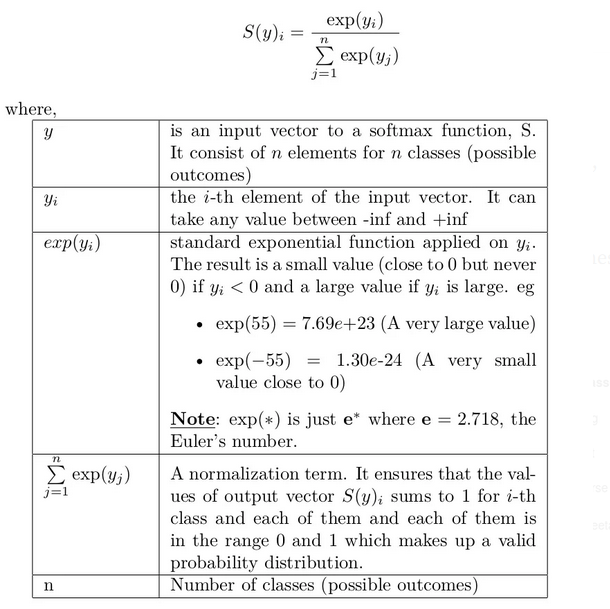

### Word Representation
- Learn how boy is to man
- Pick up and filter out biases and stuff between words
- Words being 1 hot representations
  - Downfall is that it treats the word as a thing within itself and doesn't seem relationships between the words
#### Featurized Representation: word embedding
- Man, Woman, King, Queen, Apple, Orange -> Gender [-1, 1, -0.95, 0.97, 0.00, 0.00]
- Man, Woman, King, Queen, Apple, Orange -> Royal [0.01, 0.02, 0.93, 0.97, -0.01, 0.00]
- You can have a vector to represent the word "man", "woman", etc. which will highlight the characteristics of the word.
#### Visualizing word embeddings
- t-SNF is one of the visualizations
- Word embeddings are one of the most important ideas in NLP
### Using word embeddings
#### Naming entity recognition example
- Generalizing to different sentences.
#### Transfer learning and word embeddings
1. Learn word embeddings from large text corpus.
2. Transfer embedding to new task with smaller training set
3. Optional: Continue to finetune the word embeddings with new data.
- The process of transfer learning in NLP is good usually when you trained on a larger set and apply it to a smaller dataset.
  - The intuition for that could be if you go from a smaller to a larger dataset there may be some words that the network never encounters in the smaller dataset.
#### Relation to face encoding.
- With face recognition you want the neural network to generate an embedding for a picture it never encountered in the training set.
- With word embeddings you want the neural network to learn a fixed vector.
### Properties of Word Embeddings
#### Analogies
- Let's say I pose a question like man -> woman as king -> ?
  - With this question to find the answer you are subtracting the vectors for each respective word.
#### Analogies using word vectors
- Imagine the words being plotted on a multi-dimensional space.
- The most commonly used similarity function is called Cosine similarity
#### Cosine Similarity
- Word embeddings can learn similarities really well.
  - I wonder what else I can vectorize in the world and make into an application?
    - An analogy reasoning system?
### Embedding Matrix
- Techniques for learning these embeddings(algorithm)
- One Hot Encoding technique:
  - If there are 10000 words then you have a 10000 dimensional vector
  - And there is a 300 dimensional embedding vector for each word. (the 300 is arbritrary)
  - There is a multiplication that selects the correct 300 embedding(One hot vector times the E vector = embedding vector)
### Learning Word Embeddings
- Starting with the more complex algorithms and then introducing the more simple ones. Its easier to see why the more complex ones work.
#### Other context/target pairs
- You can use as context the words before it. Or you can do the words before it and after it.
- Or you can do only the word before it or after it.
- Or you can do the nearby 1 word. Nearby means it does not have to be the word right before or right after it.
- And have the network try to predict the target word.
### Word2Vec
#### Skip-grams
- Example Sentence:
  - I want a glass of orange juice
- Come up with a few context to target pairs.
- We could use the word orange and try to predict the randomly chosen word within a plus or minus 10 word window. This is not a easy learning problem. But the goal is not to do well on the supervised learning problem but we want to use this learning problem to learn good word embeddings.
#### Model
- Vocab size = 10,000
- Context c ("orange") 6257th word -> Target t ("juice") 4834th word
- We get the embedding vector and pass into into the softmax layer to get y hat.
- Review: what is softmax? -> converts a vecotr of K real numbers into a probability distribution of K possible outcomes. All of the outputs of softmax summed together will equal one. Here is the formula: 
#### Problems with softmax classification
- Hierarchical softmax tree: go down the branch where the word is most likely to exist.
  - This is one idea for speeding up the softmax classifier.
- Sampling the context c. There is a technique for sampling from the more commonly occuring words.
- negative sampling might be better than this because you will not have to go through summing the whole vocabulary in the denominator of the algorithm.
### Negative Sampling
- This will allow us to do something similar to the skip gram model but it will much simpler.
#### Defining a new learning problem
- We are going to sample a context and sample word. With positive examples (correct target/context pair) and negative examples(incorrect target/content pair).
- We are going to generate the negative samples by sampling the target word randomly from our dictionary. its okay if one of those ends up becoming a positive example
- We are going to train the softmax classifier on k negative examples and one positive example instead of having the whole vocabulary in the denominator.
#### Selecting negative examples
- There is this heuristic that people in the paper used that seemed to work well for selecting negative examples.
### GloVe Word Vectors
- Global Vectors for Word Representation
- This algorithm is not used as much as word2vec. But it has some momentum because of its simplicity.
- Xij is a count of how many times the words i and j appear next to each other??
- Its really difficult to look at the rows of embeddings and assign it human interpretable meanings.
### Applications Using Word Embeddings
### Sentiment Classification
#### Problem
- x: The desert is excellent ---> y 4 stars
- Make a system to monitor comments. How positive or negative is the comment.
- One of the problems in sentiment classification is that you might not have a huge labeled dataset.
- You can have a simple model that ignores word order and it can give false positives.
#### RNN for Sentiment Classification
- Can solve the ordering problem. It can take word sequence into account.
### Debiasing Word Embeddings [paper: Bolukbasi et. al., 2016 Man is to computer programmer as woman is to homemaker? Debiasing word embeddings]
- Make sure that word embeddings do not have the biases like gender, ethnicity, etc.
- Example Father:Doctor as Mother:Nurse
  - Man:Computer_Programmer as Woman:Homemaker
- Learning algorithms are making very important decisions like in college applications and in the justice system. So its important to reduce these biases.
#### Addressing bias in word embeddings
1. Identify bias direction
   - eHe - eShe
   - eMale - eFemale
   - ...
   - Take the average
   - This can find the direction of the vector for gender!!!!
2. Neutralize
   - For every word that is not definitional, project to get rid of bias.
   - Reduce the pull in the bias direction by going opposite it.
3. Equalize Pairs
   - Make sure words for example that are gender defining are the same from gender neutral words like baby sitter. Grandmother, Grandfather -> babysitter.
- How do you find which words should be neutralized?
- The people in the paper trained a classifier to find words in the english language that are definitional!
- The full algorithm is more complicated than what is presented here.