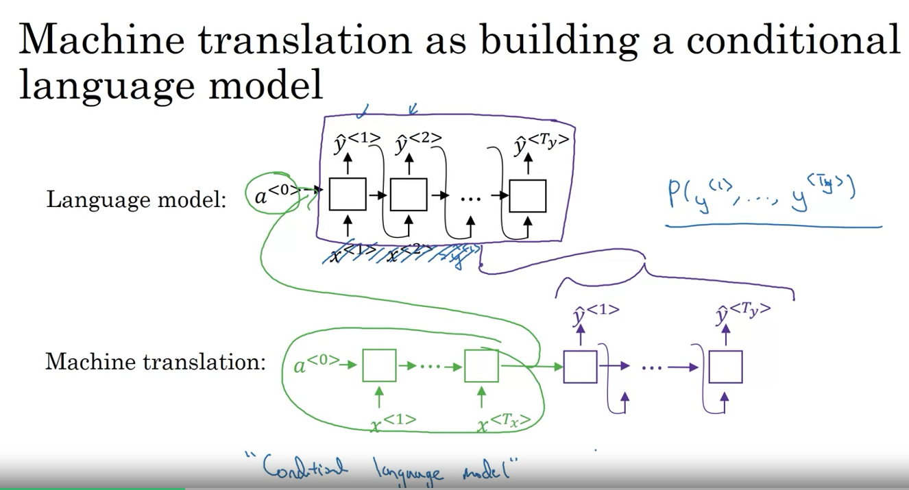
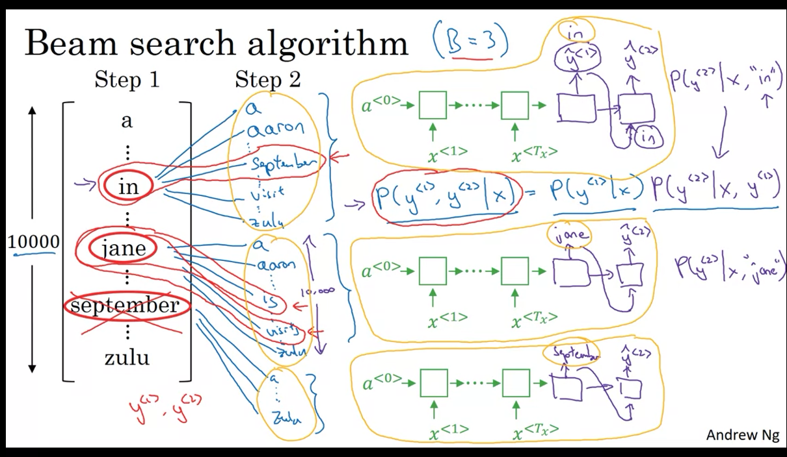
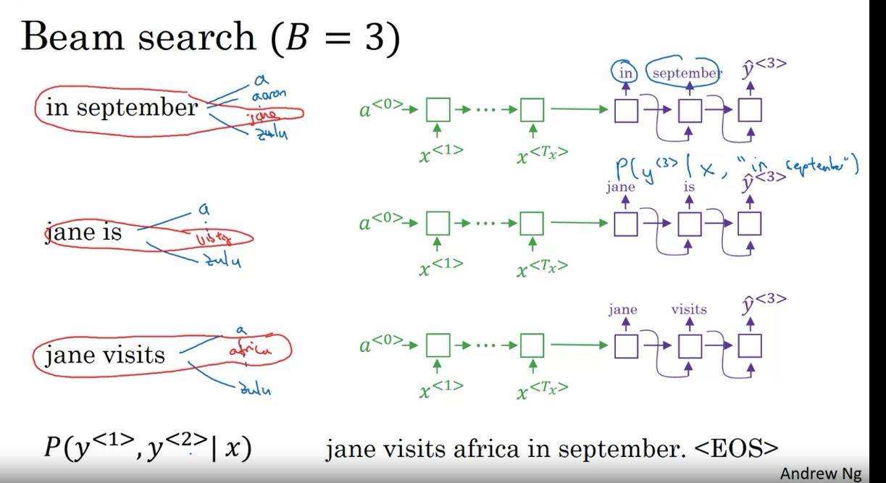
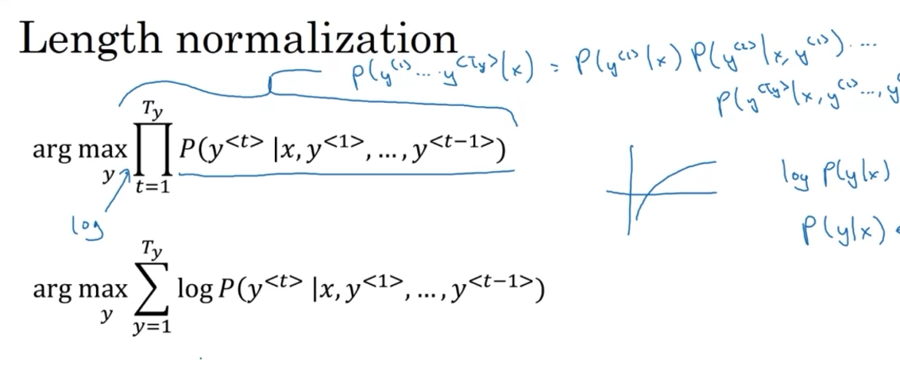
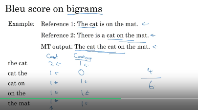
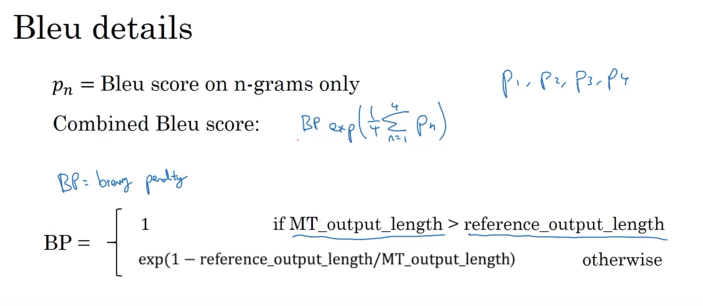
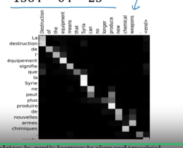

### Week 3
### Basic Models
#### Sequence to Sequence Model
- This is good for French to English translations
- There is a encoder network and decoder network for these translations.
#### Image Captioning
- There were multiple models coming out about the same time for this kind of task.
### Picking the Most Likely Sentence
#### Machine Translation as Building a Conditional Language Model
- Machine translation model is very similar to the Language Model except instead of starting out with a vector of zeros it instead has an encoded network that figures out some representation for the input sentence.
  - And it takes that input sentence instead of the representation of all zeros.
- 
- And it is called the "Conditional Language Model" by Andrew Ng since the input sentence is fed into the network as the input?
#### Why not a greedy search?
- Greedy search is a computer science algorithm that says to generate the first word pick whatever is the most likely first word according to your conditional language model. Then pick the second best word and so on..
- going is a common french word so you may get a translation like "Jane is going to be visiting Africa in September" instead of "Jane is visiting Africa is September". This is kind of a hand wavy explanation.
- Its not always optimal to pick one word at a time.
- So we go with Beam search.
- The set of all english sentences is too large to enumerate through. Beam search will have a solution!
### Beam Search Algorithm
- Whereas Greedy Search will pick only one most likely wordd and move on, Beam Search can consider multiple alternatives.
  - Beam Search has a parameter called B which is called the beam width and it means that Beam search will consider three possibilities at the same time.
  - This still does not deal with the problem of searching all possible English sentences.
  - say you have a input French sentence, you run that input through the encoder network.
  - Then in the first step you decode the network and this is a softmax probability of 10,000 (where does this number come from?)
- 
    - There are three copies of the network with different starting words from **step 1**
- 
### Refinements to Beam Search
#### Length Normalization
- 
  - I think that first formula is multiplying all of the numbers and the second one is summation.
  - Use log to avoid numerical underflow issues.
  - You can do the sum of logs of the probabilities instead of the product of probabilities
- Because the log is a strictly monotonically increasing function, we know that maximizing log p of y given x should give you the same result as maximizing p of y given x.
- A heuristic or a hack is what people found works best through trial and error.
#### Beam search discussion
- How do you set the Beam width B?
  - large B: better result, slower
  - small B: worse result, faster
- Unlike exact search algorithms, Beam Search runs faster but is not guaranteed to find exact maximum for arg max P (Y | x).
### Error Analysis in Beam Search
- Figure out whether its your Beam Search that is causing problems or the RNN that is causing problems.
  - I guess we are using both an RNN and Beam Search algorithm somehow. I wonder what this architecture is called.
  - The RNN model is really a encoder and decoder.
  - Compute the P( y_goal | x) and P(y_pred | x) you can compare the probalities here and decide whether its the RNN or Beam Search that is causing issues. So what are the steps behind this?
    - If the y_goal example has a higher prob then Beam Search is at fault. If y_pred has a bigger probabilty then the RNN is at fault.
#### Error Analysis Process
- Go through the Human vs the algorithm predicitons. Figure out what fraction of errors are "due to" beam search vs. RNN model.
### Bleu Score (Optional)
- One the problems with machine translation is that there are multiple correct translations with language. If there are multiple correct answers, how do you measure accuracy. Its conventionally done through a BLEU score.
- BLEU - Biligual Evaluation Understudy.
  - The intuition behind the BLEU score is that we are going to look at the words that the machine generates and compare it to what the human answer is.
  - Its a fraction. In the numerator we have the number of times the word appears in the test set. And the denominator is the number of times the word appears in the machine generated response. The numerator is the maximum number of times the word appears in the test/dev set. Honestly instead of test/dev set just say human answers.
  - We do not want to just look at words in isolation. So we look at bigrams.
#### BLEU score on Bigrams
- Bigrams are taken as the word and the word next to that word. And its all the possibilities of that. We make the pairs going one word at a time and not skipping pairs.
- 
- Combined Bleu Score: 
  - p1 is unigram, p2 is bigram, p3 is trigram, etc..
### Attention Model Intuition
- This attention idea makes the encoder/decoder architecture much better!
#### The problem of long sequences
- By working one part of a sentence at a time there is a dip when the sentence gets longer.
#### Attention Model Intuition
- In the attention model we use an RNN to encode. And there is an attention weight for each word. The attention weight changes when you go to the next word in the sequence. What the attention weight does is it tell you how much attention to pay to each word. Also the output of the previous RNN block is passed to the next block. So the RNN block both takes in the previous input, the attention weights, and the current word. 
  - We pay attention as in ? What does attention really mean?
  - The "attention" words are the context. So what is the previous output being input for
### Attention Model
- You have an input sentence and typically you use a bidirectional RNN, bidirectional GRU, or bidirectional LSTM to compute features on every word.
#### Computing attention a^\<t, tprime\>
- This part is confusing I do not understand Andrew Ng's explanation.
- But we train a little neural network here to learn a function. I don't even know where to go to understand the next explanation where he goes into the intuition of what this is.
- One downside to this algorithm is that it runs in quadratic time.
  - Mamba could be reducing this!
- Image captioning is another area where this architecture has been used.
- This is interesting when you visualize the attention weights. It shows that when you are generating a word (for translation purposes) it does have the weights highlighting the correct input word to pay attention to.
- 
### Speech Recognition
#### Speech Recognition Problem
- You are given a audio clip x and you want to output the transcript y.
- \<Is that spotify mp3 to midi project using a sequence to sequence model?\>
- These used to be created out of phonemes. Linguistics used to hypothesize that writing down phonemes would be the best way to create these speech recognition algorithms.
  - These phonemes were hand engineered. I feel like I have seen the model that does this somewhere.
- We can use the Attention model for speech recognition.
#### CTC cost for speech recognition
- CTC - (Connectionist temporal classification)
- Basic rule: collapse repeated characters not separated by a blank.
### Trigger Word Detection
- This is easier to build than the speech to transcript example given above.
- Exampler of this are 'Hey Siri', 'Amazon Echo', 'Apple Siri'
#### Trigger Word Detection Algorithm
- OOOOO I can not wait to build this.